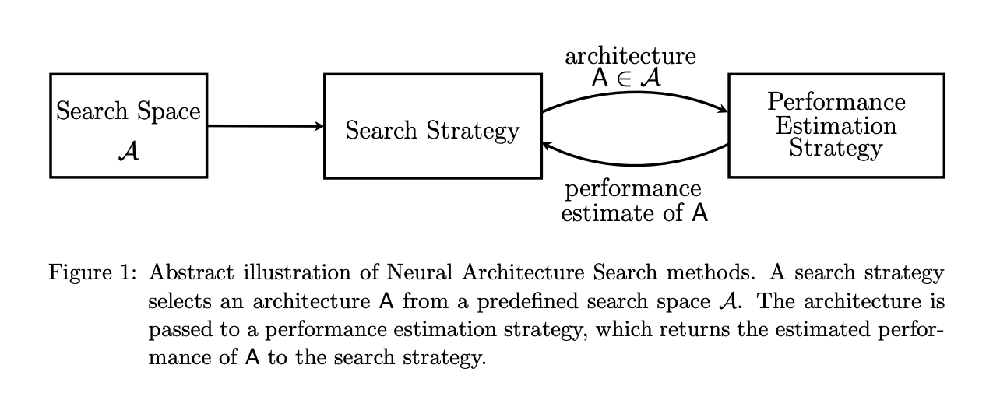
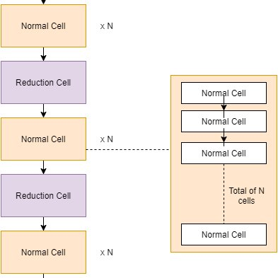
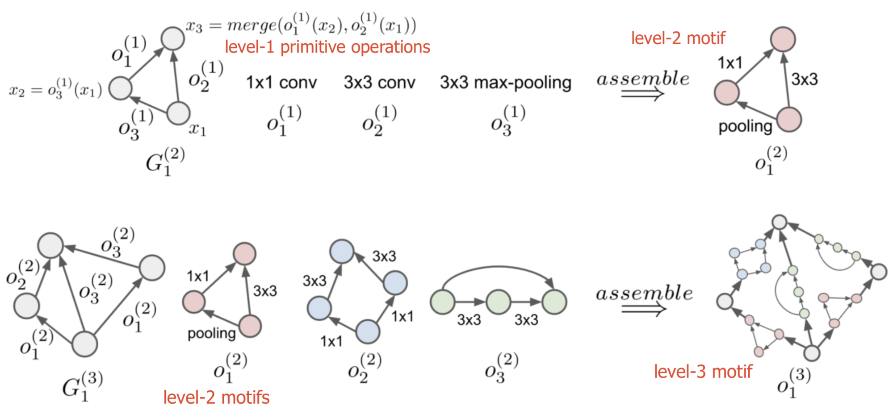
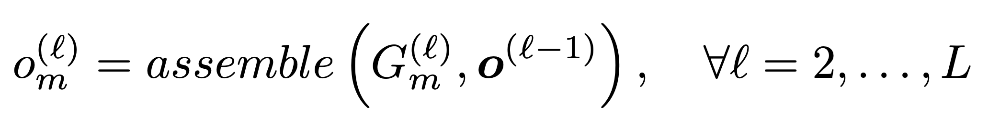
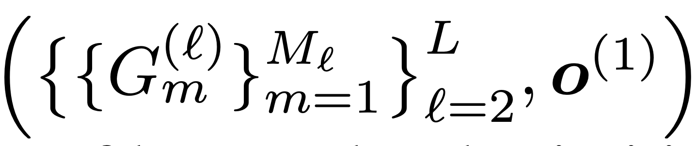
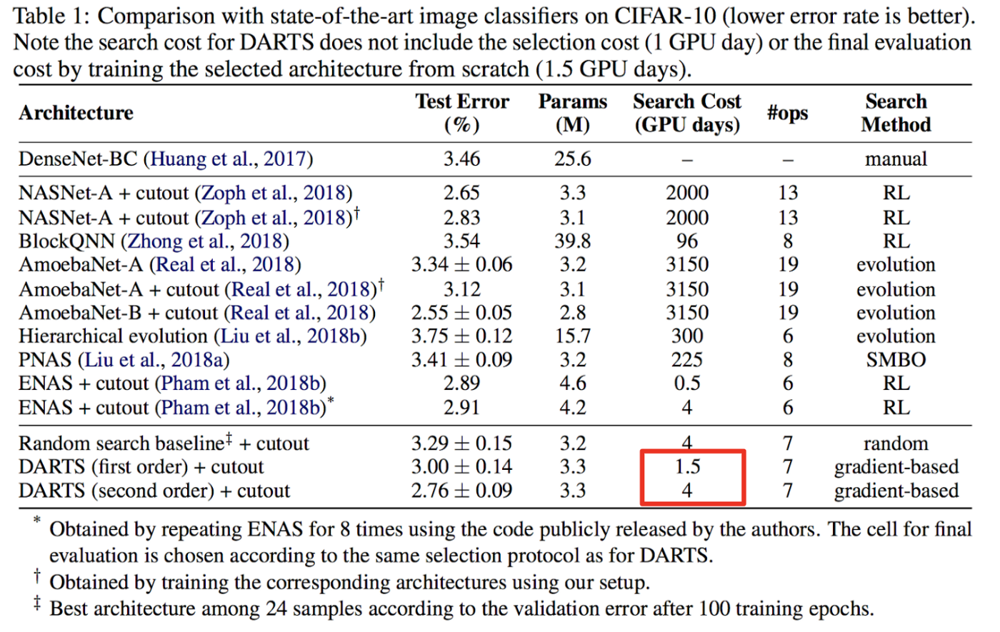
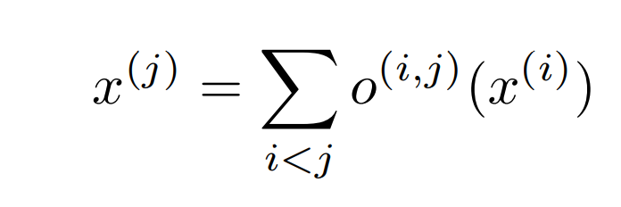
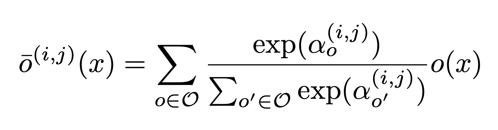
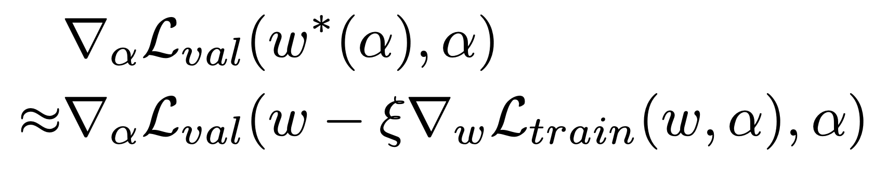
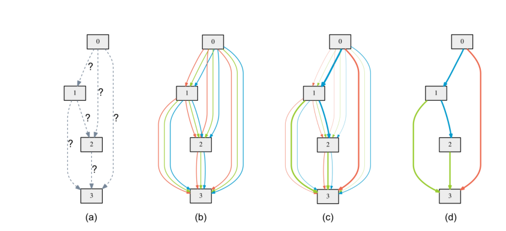

# Memory-Efficient Hierarchical Neural Architecture Search for Image Denoising (HiNAS)  
[Memory-Efficient Hierarchical Neural Architecture Search for Image Denoising](https://arxiv.org/abs/1909.08228)  
Neural Architecture Search (NAS) and Differential Architecture Search (DARTS) explained.  

**Image Denoising**  
Images are always contaminated by noise during an image sensing process. With the presence of noise, the visual quality of the collected images are degraded. Therefore, image denoising plays an important role in various computer vision tasks.  
Image denoising underlying goal is to restore a clean image from a noisy image.  

-----

## Neural Architecture Search  
Neural Architecture Search (NAS) is a research field that first emerged from the efforts to automate the architecture design process with an aim to design the most optimal neural network architecture for a given task.  

  

**Summary of the NAS algorithm:**  
<ol>
  <li> a candidate architecture A is selected from a pre-defined search space </li>  
  <li> the proposed architecture is passed to performance estimation strategy and the estimated performance is returned </li> 
  <li> Based on the search strategy, the next candidate is proposed.  </li>
</ol>

**Search space**: The NAS search space defines a set of operations (e.g. convolution, fully-connected, pooling) and how operations form network architectures. The search space determines the neural architecture to be assessed.  

**Search Strategy**: The search strategy is used to choose a candidate from a population of network architecture and to avoid bad architectures. Child model performance metrics act as a reward to generate high-performance architectures. There are many search strategies such as Reinforcement Learning, Bayesian Optimization, Evolutionary Algorithms, Gradient-Based Optimization, or even Random Search.  

**Performance estimation strategy**: feedback for the search algorithm is obtained from the predicted the performance of a large number of proposed models.  

### NAS for CNN  
paper referenced: [An Introduction to Neural Architecture Search for Convolutional Networks](https://arxiv.org/abs/2005.11074)  

There are two general approaches to Search Spaces in NAS for convolutional layers.  
	**Global Search Space**  
First we have the Global Search Space (with the search known as macro-architecture search) which allows the optimization algorithm to generate arbitrary networks. For each network the algorithm chooses each layer’s type, hyperparameters and connections with other layers.  

  **Micro or Cell based Search Space**  
HiNAS uses the cell based search space method - and more specifically Hierarchical Search Spaces which we will read about later. Micro or Cell based Search Space methods limits the optimization algorithm from creating arbitrary networks.  
Motivated by the many effective handcrafted architectures designed with repetitions of fixed patterns, A cell-based search space consists of repeated blocks of layers called Cells.  

  

**Hierarchical Structure**  

In many NAS methods, both macro and micro architectures are searched in a hierarchical manner.  
Hierarchical structures start with small sets of primitives, including individual operations (e.g. convolution operation, pooling, identity). Then small sub-graphs also known as motifs consist of primitive operations that are used to form higher-level computation graphs. 

    A computation motif at starting at the lowest to the highest level ℓ=1,…,L can be represented by (G(ℓ),(ℓ)), where:
    (ℓ) is a set of operations, (ℓ)={o(ℓ)1,o(ℓ)2,…}
    An adjacency matrix G(ℓ) specifies the neural network graph of operations, where the entry Gij=k indicates that operation o(ℓ)k is placed between node i and j. 

(Illustration of the assembly process) An example of a three-level hierarchical architecture representation. The bottom row shows how level-1 primitive operations o1(1), o2(1), o3(1) are assembled into a level-2 motif o1(2). The top row shows how level-2 motifs o1(2), o2(2), o3(2) are then assembled into a level-3 motif o1(3). [Hierarchical Representations for Efficient Architecture Search](https://arxiv.org/abs/1711.00436)  

To build a network according to the hierarchical structure, we start from the lowest level ℓ=1 and recursively define the m-th motif operation at level ℓ as  
  

A hierarchical architecture representation is defined by,  
  

as it is determined by network structures of motifs at all levels and the set of bottom-level primitives.  

---

## Differential Architecture Search (DARTS). 
[DARTS: Differentiable Architecture Search](https://arxiv.org/abs/1806.09055)  
Differentiable Architecture Search (DARTS) is an efficient gradient-based search method which has been published at ICLR 2019.  

  

**Improvements**. 
DARTS is shown to find architectures in image classification in only a matter of a few GPU days while archiving state of the art performance.  
There are 3 keys ideas that makes DARTS efficient: 
(1) only search for small “cells”, 
(2) weight sharing, 
(3) continuous relaxation. 

NAS search spaces are discrete for example one architecture differs from the other by a layer, parameter, filter size etc. In DART continuous relaxation is introduced to enable direct gradient-descent optimization to the discrete search.  

The cell we search can be though as a directed acyclic graph where each node x is a latent representation (e.g. a feature map in convolutional networks) and each directed edge (i, j) is associated with some operation o(i,j) (convolution, max-pooling, etc) that transforms x(i) and stored a latent representation at node x(j)  

  

the output of each node can be calculated by the equation on the left. The nodes are enumerated in such a way, that there is an edge(i,j) from node x(i) to x(j), then i<j.  

In order to transform the problem of architecture search to a continuous one, let us consider a set O of operations, such as convolutions, dilated convolutions, max pooling, and zero (i.e., no connection). We can then parametrize o(i,j) as  

  

This is done with a softmax function.  

The training loss L_train and validation loss L_val are determined by the architecture parameters α and weights ‘w’ in the network. The aim of the architecture search is to find α∗ of the validation loss  L_val(w ∗ , α∗ ) to be minimized, where the weights ‘w*’ associated with the architecture is obtained by minimizing the training loss.  

    w∗ = argmin L_train(w, α∗ ).  

    α * = argmin L_val(w ∗ (α), α)
    s.t. w ∗ (α) = argmin L_train(w, α)

The approximate gradient can be found since α is now continuous. ξ is assumed to be the step of an inner optimization learning rate.

  

In continuous relaxation, instead of having a single operation between two nodes. a convex combination of each possible operation is used. To model this in the graph, multiple edges between two nodes are kept, each corresponding to a particular operation. And each edge also has a weight α.  

After training some α’s of some edges become much larger than the others. To derive the discrete architecture for this continuous model, in between two nodes the only edge with maximum weight is kept.  

 

---
## Memory-Efficient Hierarchical Neural Architecture Search for Image Denoising

Hierarchical NAS (HiNAS) is a NAS to design effective neural network architectures for image denoising tasks. HiNAS is both memory and computation efficient and is said to take 4.5 hours for searching on a single GPU. Motivated by the search efficiency, 

**HiNAS key ideas**  
* HiNAS is implemented with gradient based search strategies employing the continuous relaxation strategy proposed in DARTS.  
* HiNAS also relies on operations with adaptive receptive fields such as dilated convolutions and deformation convolutions to preserve pixel-level information. Instead of using downsample layers.  
* Flexible hierarchical search space is employed and leave the task of deciding width of each cell to the NAS algorithm itself.  
* Early stopping strategy is used to avoid the NAS collapse problem.  

**Due to the following advantages:**  
* gradient based search strategy. HiNAS only needs to train one supernet in the search stage unlike Evolutionary Algorithms based NAS method.  
* Cells shared across different feature levels, thus saving memory consumption.  
* early-stopping search strategy.  

Metrics used to evaluate model for image denoising are PSNR and SSIM.  

