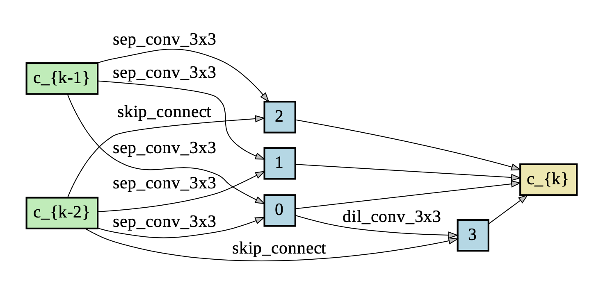
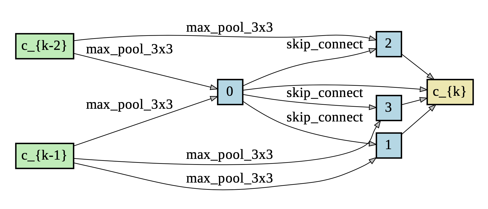
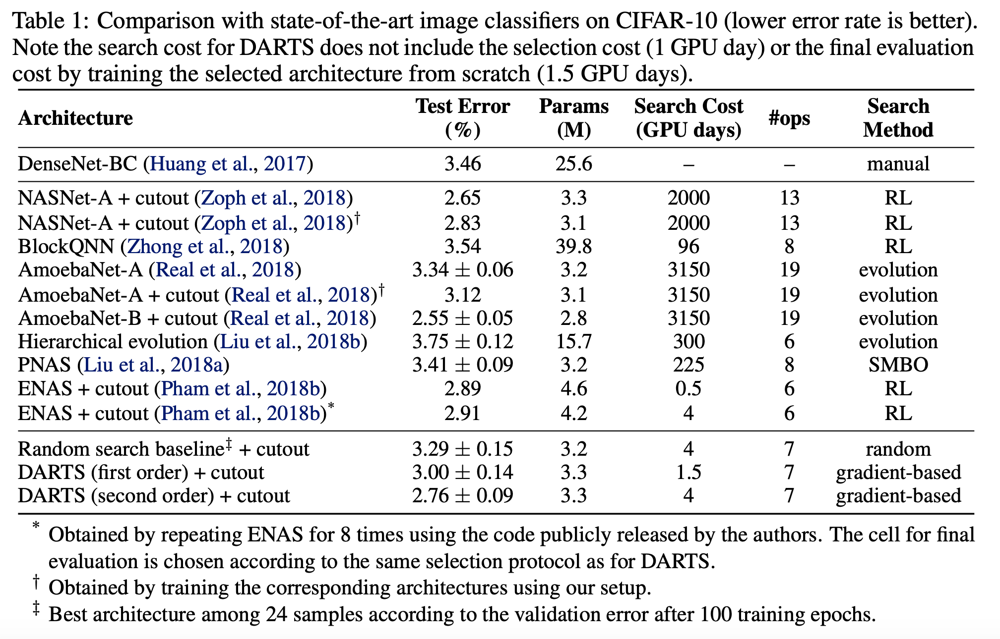

# Differentiable Architecture Search  
[DARTS Official implementation](https://github.com/quark0/darts)  
## Dataset 
DARTS on CIFAR-10 dataset 
The test error rate is expected to be 2.63% with 3.3M model params.  

I have tried to reproduce the results of DARTS using the official implementation.  
Firsly, here is the [DARTS Test on pretrained model Google Colab ipython file](https://colab.research.google.com/drive/1pfZsDQRcqXUEI4XIz_zLpG5bJqpmohxL?usp=sharing)  

**Some changes made:**  
1. new changes: PyTorch == 1.6.0, torchvision == 0.7.0  

On the Official Implementation of DARTS the requirements are 
    
    PyTorch == 0.3.1, torchvision == 0.2.0  

Torch 0.3 is incompatible with CUDA 9 and above, so I have tried to install CUDA 8 instead. However, Colab uses Tesla T4 GPU which requires CUDA 9 and above. Google Colab comes with already installed CUDA 10.1. For this experiment we will use Torch 1.6.0 which is preinstalled by Colab.  

2. when passing a .py file to ipython notebook environment some changes has to be made  
The official implementation consisted of .py files which means:  

To test pretrained model:  

    cd cnn && python test.py --auxiliary --model_path cifar10_model.pt
    
To train model from scratch:  

    cd cnn && python train.py --auxiliary --cutout
    
Some arguments such as args parse and sys were modified to call user input directly into the code.  

3. Batch size is originally set to be 96 and is modified to take batch size of 64.  
The batch size is reduced to 64 due to CUDA out of memory error. CUDA tried to allocate 20 MiB of memory when the maximum size it can allocate is 14 MiB.  

4. Make modifications to the code to support PyTorch 1.6.0.  
Due to the incompatibility, small changes were made to the code to help support PyTorch 1.6.0.  

5. Removing duplicate Libraries.  
Since .py file were combined into a single ipynb file, duplicate libraries were found.  

**Results from test**  
Package graphviz is used to visualize the learned cells.  
* Normal Cell  

  

* Reduction Cell  

  

I have attempted to reproduce the results of DARTS.  
here is the [DARTS Trained from scratch Google Colab ipython file](https://colab.research.google.com/drive/1B1WKhYY8_H6gDdP9dTeZWKm8NuV9fiz2?usp=sharing)  

Modifications to the official implementation to view Normal and Reduction Cells at every epoch iterations.  
The snapshot of cells at each epoch are named:  
    
    normal#number_of_epoch and reduction#number_of_epoch.  

To visualize the cells, go to [DARTS Visualize cells Google Colab file](https://colab.research.google.com/drive/18gkaH7xHPIDROLGJAcnDI2x1tVtZrrEh?usp=sharing)  

Turns out that the cells look exactly the same at each epoch.  
View Genotypes.py file to see the fixed structure of the cells.  

## Performance Indicators
The objective of DARTS as shown is to reduce search cost while still archiving low test error rate.  

  

