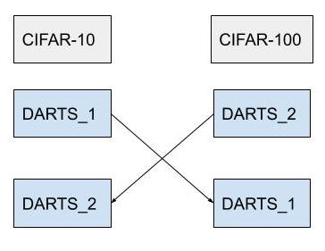

# Analyzing Neural Architecture Transferability of Differentiable Architecture Search  

## Limitations of NAS (Neural Architecture Search)  

Most existing NAS approaches require one complete search for each deployment specification of hardware or objective, which makes it computationally impractical given the potentially huge number of application scenarios.  

Also most NAS approaches show to perform well when searching an architecture for a specific dataset and/or tasks but face challenges of generalizing due to the computational burden of running NAS searches for every new target domain.  

So for this research experiment, we propose to analyze the architecture transferability of DARTS by performing experiments on CIFAR-10 and CIFAR-100 datasets and to visualize the architecture cells to observe it’s changes.  

## Limitations of DARTS (Differential Architecture Search)  
There are a number of NAS strategies proposed, including evolutionary methods, reinforcement learning, and gradient based methods.  
DARTS falls under a gradient based method as we relax the search space to be continuous instead of searching over a discrete set of candidate architectures. This allows the architecture to be optimized with respect to its validation set performance by gradient descent.  

“To make the search space continuous, we relax the categorical choice of a particular operation to a softmax over all possible operations:” — DARTS paper [2]  

Differentiable approaches such as DARTS require high GPU memory consumption, which still makes direct search on large dataset to be challenging. A widely used approach to address efficiency on NAS methods is to search for an architectural building block on a small dataset. [1]  

For our experiment we will train DARTS on CIFAR-10 and CIFAR-100 which are relatively small datasets.  

---

## Propose solutions and plans  

For this research experiment a couple of problems of existing research are determined and solutions with plans are proposed to solve them. I have divided the plan up into 3 groups.

### 1. Architecture transferability.  

For this task we want to train two DARTS model to search the cell architecture on a small dataset on CIFAR-10 and CIFAR-100 respectively.  

 

Figure 1. DARTS_1 is pretrained on CIFAR-10 and DARTS_2 pretrained on CIFAR-100 for the same amount of time before runtime disconnect. Using the weights obtained we continue training on by swapping datasets and loading the weights. DARTS_2 is trained on CIFAR-100 and DARTS_1 is trained on CIFAR-10 for the same amount of time.  
CIFAR-10 and CIFAR-100 are chosen as both consist of 32 x 32 sized images, this makes training of the model to be easier. 

We want to evaluate DARTS performance with transfer learning on the new dataset, CIFAR-10 and CIFAR-100 when pretrained on CIFAR-100 and CIFAR-10 respectively.
Our main objective is to find the pattern in the network architecture and the underlying reason for its resulting performance.  

Google Colab allows a maximum GPU runtime of 8~12 hours before runtime disconnect. The experiment will ideally run for less than 24 hours.  

### 2. Visualizing Normal and Reduction Cells  

We want to be able to visualize the Normal and Reduction Cells at the end of pretraining DARTS_1 and DARTS_2. The network is then compared to Cells produced at the end of training. To analyze the changes to the network structure before and after transfer learning.  

**To recap:**  
Normal Cells are thought of as normal blocks which compute the feature map of an image. Convolutions and poolings in each block have a stride of 1.  
Reduction Cells are normal blocks which downsample/ reduce the feature map dimensions. Convolutions and poolings in each block have a stride of 2.  

From stage-2 research, we figured that the visualized learned cells do not change with epoch iterations. This time, we want to visualize the internal structures of the cells in the hopes to find a pattern with transfer learning.  

### 3. Cell Sharing technique  

If time allows we could bring own the computation time of DARTS using HiNAS cell sharing technique. Share cells across different feature levels, saving memory consumption in the supernet and employ an early stopping strategy to avoid the collapse issue in NAS as shown in HiNAS [3].  

---

## Extra findings/ research.  

There are existing research that measures the architecture transferability performance of DARTS and various other NAS methods included and proxy sets for large scale NAS as  presented in the finding In the paper:  
**NASTransfer: Analyzing Architecture Transferability in Large Scale Neural Architecture Search** [link](https://arxiv.org/abs/2006.13314).  
Four diverse and challenging datasets within image classification namely CIFAR-10 and CIFAR-100, ImageNet1K and ImageNet22K to evaluate the performance of different methods in this paper.  

The paper’s main objective is to "provide diagnostic information on the architecture transfer performance of different NAS methods and proxy sets for large scale NAS".  
The paper adopts "a common search space and training protocol to avoid the effect of the manually engineered tricks and search space widely used in different NAS methods". - NASTransfer   

There are many similarities shared between our research objectives such as approaches to measure the architecture transferability performance of DARTS on CIFAR-10 and CIFAR-100 datasets.  
We propose a different approach from the paper by (2) visualizing the cells (3) improve computation by implementing cell sharing.  

