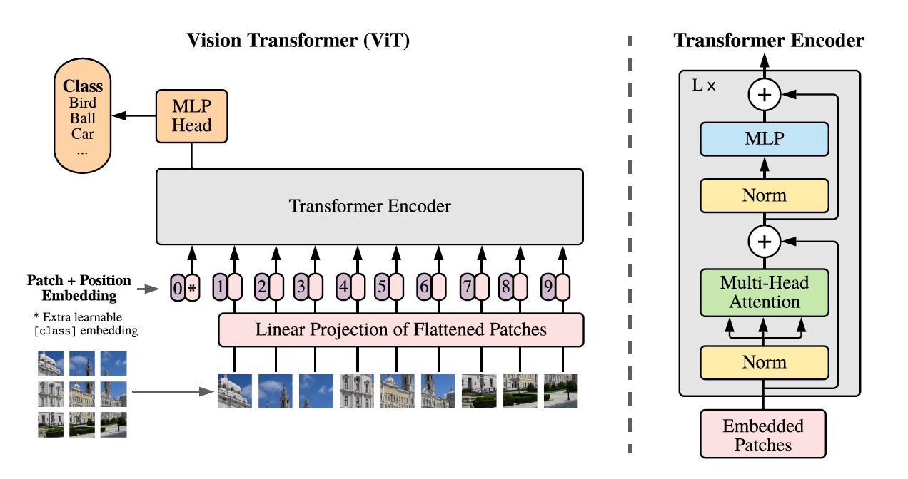
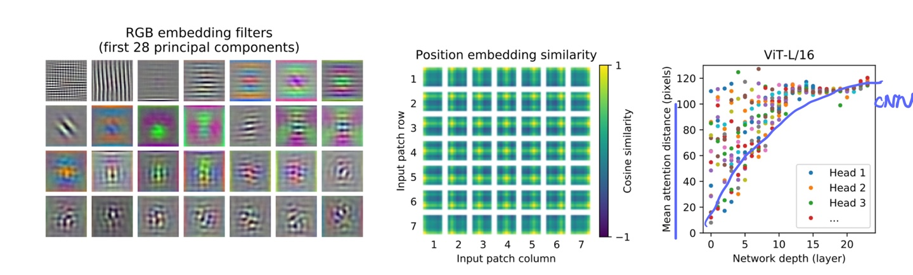
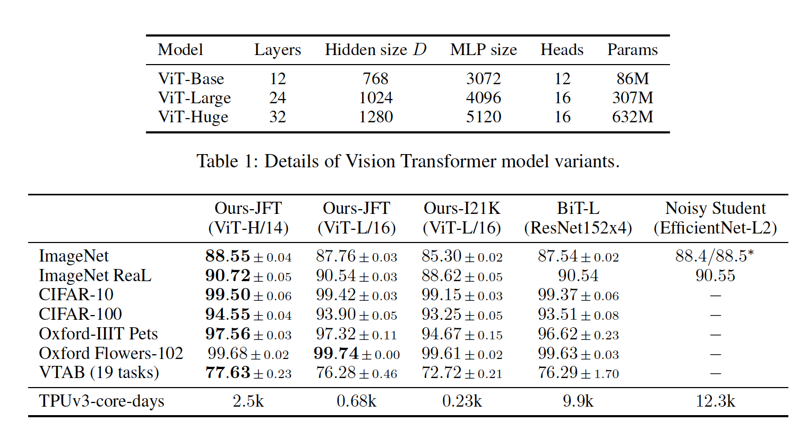

# An Image is Worth 16x16 Words: Transformers For Image Recognition at Scale  

## Related Works & Prerequisites for Visual Transformers

### BERT (Bidirectional Encoder Representations from Transformers)  
[Bidirectional Encoder Representations from Transformers](https://arxiv.org/abs/1810.04805)  
Before we take a look at ViT let’s look at the classic NLP state-of-the-art: BERT, published by researchers at Google AI Language in 2018.  

#### There are three main ideas from BERT:  
* bidirectional   
The order of inputs for a transformer is bidirectional which means that the sequence of inputs no not need to be processed in order unlike RNNs.
Which means that the Transformer can process the middle or the end of the sentence first before it processes the beginning of a sentence. 
* Encoder Representation  
BERT includes Encoders to understand the context of words. Encoders consists of two components: Self-Attention and Forward Feed Network
* Self Attention  
Attention gives the capability to understand the relationship core mechanism between words. 

**How does it work?**  
The input is a sequence of tokens, which are embedded into vectors and then processed in the neural network.

Results show that a bidirectionally trained language model can have a deeper sense of language context and flow than single-direction language models. 

----

### Convolutional Neural Networks (CNN)
To understand how Visual Transformers resolve the weakness in Convolutional Neural Networks we need to first know about the strength and weaknesses of CNNs.  

**Strengths of CNNs**  
* CNN has inductive biases like translation invariance and locally restricted receptive field. Translational invariance helps to recognize an object even when its appearance varies, for example: rotation, zoom in/out. 
 
  

**Weaknesses of CNNs**  
* CNNs are specifically designed for images.  
* CNN is not scalable for it to be domain agnostic due to its domain-specific design. CNN uses pixel arrays where each pixel represents the varying importance.  
* CNN lacks a global understanding of the images unlike ViT. CNNs does not understand the structural dependency between its features but look for the presence of the image's features.  
* Computationally expensive due to each pixel bearing varying importance for the target task, this leads to redundancy in both computation and representations.  

----

## Visual Transformers
### An Image is Worth 16x16 Words: Transformers for Image Recognition at Scale
[An Image is Worth 16x16 Words: Transformers for Image Recognition at Scale](https://arxiv.org/abs/2010.11929)  

Transformer models can handle variable sized input using stacks of Self-Attention instead of CNNs & RNNs, and they have worked excellently with NLP and are now applied to images. Visual Transformers (ViT) is a modification to the Transformer design to make it operate directly on images instead of words.  
The input image is represented as a sequence of images patches in ViT is similar to the sequence of world embeddings used when applying Transformers to text (like BERT!).  

**How are CNNs and ViTs different?**  
Visual Transformer(ViT) uses visual tokens of divided input image and CNN uses pixel arrays.

#### Solutions to the Major Challenge of Transformers  
**A major challenge** of Transformer without CNN to images is applying Self-Attention to each pixels making the cost of self attention to be quadratic. 
If we have a 32 x 32 input image, each pixel of the image will be passed as an input, the model will need to calculate self attention for 1024 combinations. 
This operation very expensive and will not scale to realistic input size. To overcome this problem, ViT divides the images into small 16 x 16 patches. Also, a pixel at a corner of an image will probably not have a meaningful relationship with another pixel at the other corner of the image so images are segmented into patches.  

 

#### Workings of Visual Transformer  

Input image is split into fixed-size 16 x 16 patches.  
An input Image of size H x W is split into N patches where N = H * W / P². 
Each patch is flattened into a vector embedding by concatenating all pixel channels in a patch and then linearly projecting it to the desired input dimension. Learnable position embeddings are added to each patch which allows the model to learn about the structure of the image. Extra learnable “classification token” is added to the patch embedding at the start of the sequence. (0|*). This sequence of patch embedding vectors will be used as an input sequence length for the Transformer Encoder.  

Note: ViT-Large has 24 layers with the hidden size of 1024 and 16 attention heads.  

#### Transformer Encoder  
Multi-Head Self Attention Layer (MSP) concatenates the multiple attention outputs linearly to the expected dimensions. The multiple attention heads help learn local and global dependencies of the image.
ViT uses multi-head self-attention which helps remove image-specific inductive biases.

I believe Multi-Head Attentions need a separate explanation of its own as thats the part that the magic happens: ADDLINKHERE.  

#### Visualization  
**Let’s visualize some of its internal workings of ViT.**

 

ViT is shown to be able to reproduce an intuitive image structure. Let’s take a look at the position embeddings — parameters that the model learns to encode the relative location of patches. The model is able to recover the grid structure of the original images as shown - each position embedding is similar to others in the same row and column.

Lower layers of ViT is shown to capture both global and local features. By contrast, only local features are present in the lower layers of a CNN (blue line). 
> “We find that some heads attend to most of the image already in the lowest layers showing that the ability to integrate information globally is indeed used by the model”

The visualization shows that ViT can learn features hard-coded into CNNs such as awareness of grid structure, but is also are free to learn more generic patterns, such as a mix of local and global features at lower layers, that can help generalization.

#### Major Contributions made by ViT:
* Higher accuracy and less computation time. Outperforms state of the art CNNs. 
* Model architecture does not use CNNs.
* Efficacy of Transformer with small patches

 

When ViT is trained on sufficient data it outperforms the state-of-the-art CNN with four times fewer computational resources.  

> While CNNs have revolutionized computer vision, our results indicate that models tailor-made for imaging tasks may be unnecessary, or even sub-optimal. With ever-increasing dataset sizes, and the continued development of unsupervised and semi-supervised methods, the development of new vision architectures that train more efficiently on these datasets becomes increasingly important. We believe ViT is a preliminary step towards generic, scalable architectures that can solve many vision tasks, or even tasks from many domains, and are excited for future developments.

----
### References  
References to papers are written under each heading!  
TBA.  

