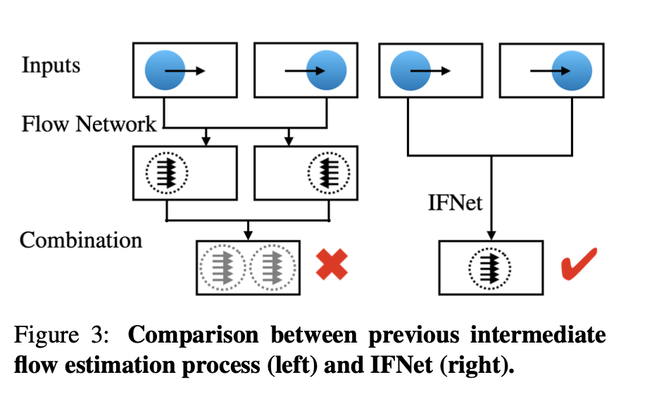

# RIFE: Real-Time Intermediate Flow Estimation for Video Frame Interpolation [paper](https://arxiv.org/abs/2011.06294)

## Prerequisites to understand RIFE
* [Guide Video Frame Interpolation](https://hxcyon.github.io/Guide-to-Video-Frame-Interpolation-Research/) Here we cover traditional VFI methods and research to understand important concepts like optical flow. Along with Flow-based methods, Flow-free methods have also shown to achieve remarkable progress in recent years. 
* [Super-SloMo](https://hxcyon.github.io/Super-SloMo-High-Quality-Estimation-of-Multiple-Intermediate-Frames-For-Video-Interpolation/) is the first successful Flow-based VFI algorithm. 

### Traditional Video Frame interpolation (VFI) methods 
VFI is challenging due to the complex, large non-linear motions and illumination changes in the real world. Flow based VFI algorithms have recently offered a framework to address these challenges and have achieved impressive results.

Common approaches for these Flow-based methods involve two steps: 
1. warping the input frames according to approximated optical flows
2. fusing and refining the warped frames using a bunch of Convolutional Neural Networks. 

According to the way of warping frames, flow-based VFI algorithms can be classified into forward warping based methods and backward warping based methods. 

---

## Overview of RIFE  

These bi-directional intermediate flows are computed directly from images by a neural network named IFNET proposed by the authors of RIFE. RIFE shown improvements of interpolation quality and have much better speed. The authors additionally proposed leakage distillation loss on RIFE that can be trained in an end to end fashion with reconstruction losses.  

## Flow-based VFI algorithms

For most flow based VFI methods, bi-directional flows are first computed from pretrained optical flow models, then these flows are linearly combined. There are two ways of warping frames for Flow-based VFI methods and they can be classified into forward warping based methods and backward warping based methods. 

Backward warping is preferred over forward warping as forward warping lacks unified and efficient implementation and as shown in (A) holes can occur in the warped image (marked in grey), when copying the pixel (x,y) to the nearest neighbor of T(x,y). Additionally Forward warping suffers from conflicts when pixels from multiple sources are mapped to the same location, which leads to overlapped pixels and holes. As shown in (B), backward warping helps eliminate this problem as intensities at locations that do not coincide with pixel coordinates can be obtained from the original image using interpolation. For example the value of pixel (x,y) is interpolated from the neighbors of T-1(x,y).

Given the input frames I0, I1, we can approximate the intermediate optical flows Ft->0, Ft->1 by backward warping from the perspective of the frame It that we are expected to generate.

### Previous methods share two major drawbacks 

 1) Real-time speed could not be achieved as bi-directional flow estimation is coupled with large complexities. Previous methods usually need to approximate various representations such as image depth and intermediate flow refinement, to eliminate artifacts brought by the linear combination of optical flows. 
 2) There is no direct supervision for the approximated intermediate flows, making the system difficult to converge. Model trained on reconstruction losses.

### Contributions in summary by RIFE

 1) A novel and efficient IFNet neural network is designed to simplify the flow-based VFI methods. IFNet can directly approximate intermediate flows Ft->0, Ft->1 given two input frames I0 and I1  and can be trained from scratch in end-to-end fashion. 
 2) Proposed leakage distillation loss function that provides effective supervision for IFNet leading to more stable convergence and significant performance improvement. 
 3) RIFE is the first flow based and real time VFI algorithm that can process 720p videos at 30 fps. 

Further, experiments have shown that RIFE can achieve impressive performance on public benchmarks.

---

## Understanding RIFE 

We will go over the components in RIFE and the proposed leakage distillation loss that serves to 
supervise the intermediate flow model. 

### The two major components in RIFE:
 1. IFNet - to efficiently estimate intermediate flows.
 2. FusionNet - Fuse the warped frames.

### IFNet 

IFNet neural network is used to directly estimate the intermediate optical flows from input images. IFNet adopts a coarse-to-fine strategy by iteratively updating a slow field via successive IFBlocks increasing the resolutions progressively. IFBlocks are ResNet blocks, containing no computationally expensive operators like cost volume or pyramid feature warping.

IFNet has a stacked hour-glass structure. A rough prediction of the flow is first made on low resolutions to capture large motions easier, then the flow fields are refined iteratively via successive IFBlocks operating on gradually increasing resolutions:

F&#770;t->0i-1 denotes the current estimation of the intermediate flow.
I&#770;0->ti-1 and I&#770;0->ti-1 denote the warped input frames using previous approximated flow, and gi represents the ith IFBlock. 

### FusionNet 

We can obtain the coarse reconstruction I&#770;0->t , I&#770;0->t, given the estimated intermediate flows Ft->0 and Ft->1 
by backward warping on input frames. To reduce the severe artifacts in the warped frames, we perform a fusion process formulated as:

> Where M is a soft fusion map used to fuse the two warped frames, ∆ is the reconstruction residual term used to refine the details in images, ⊙ is an element-wise multiplier, and (0 ≤ M, ∆ ≤ 1).

The fusion process includes a context extractor and a FusionNet with an encoder-decoder architecture similar to that of a U-Net. The context extractor is used to extract pyramid contextual features from raw inputs separately. Pyramid contextual features are denoted as: C0: {C01, C02, C03, C04} and C1 : {C11 , C12 , C13 , C14 }.
Aligned pyramid features C0->t and C1->t are produced from backward warping on these features using estimated intermediate flows. The warped frames and intermediate flows are fed to the FusionNet to product fusion map M and the reconstruction residual ∆. 

> The output of each block in the encoder part of the FusionNet is concatenated with the corresponding aligned pyramid features before fed into the next block.

###  Leakage Distillation loss for IFNet

RIFE requires strong supervision compared to other VFI flow based methods. Approximating the intermediate flow is hard due to the lack of supervision as there are no ground truth intermediate flow images. To address this problem, the authors of RIFE proposed a more advanced supervision to the intermediate flow model, named leakage distillation loss which is added during training. Leakage distillation loss employs a teacher with access to the intermediate frames during training:

{ I0 , ItGT } and { ItGT , I 1 } are fed to a pre-trained optical flow estimation network to obtain the intermediate flow prediction {Ft->1leak, Ft->0leak}.
Leakage distillation loss is applied over the full sequence of predictions.

