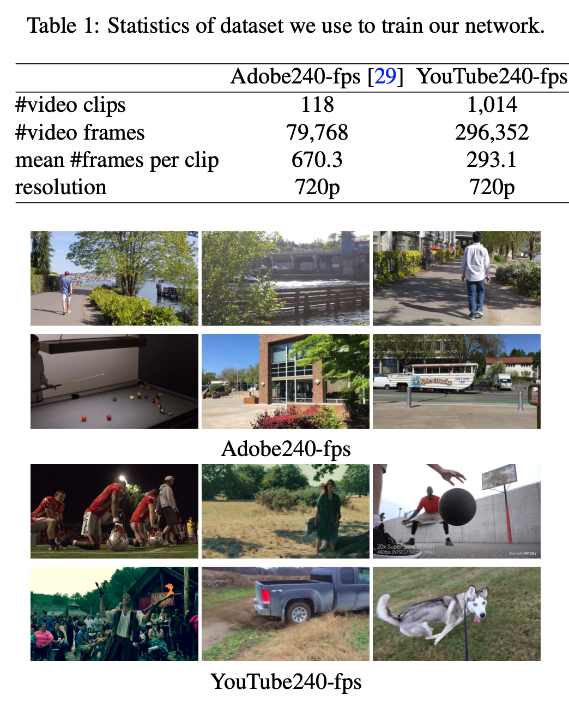
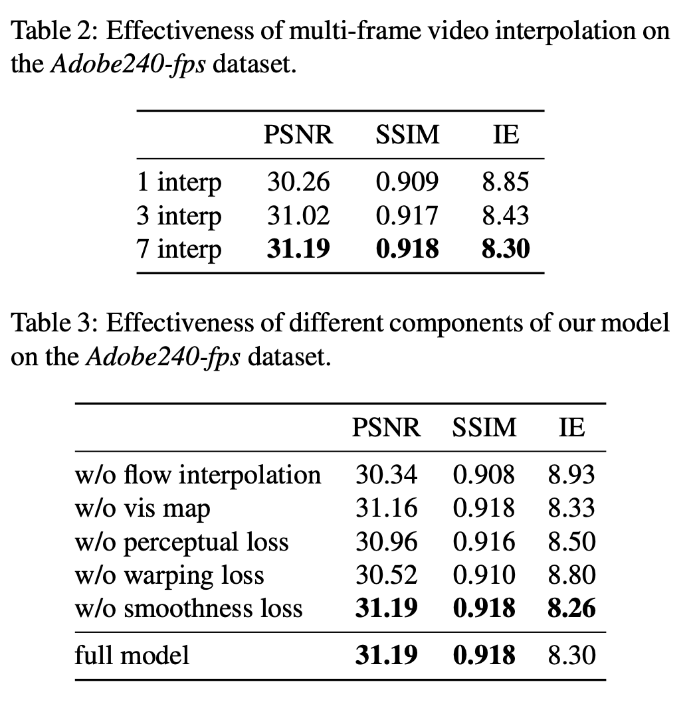
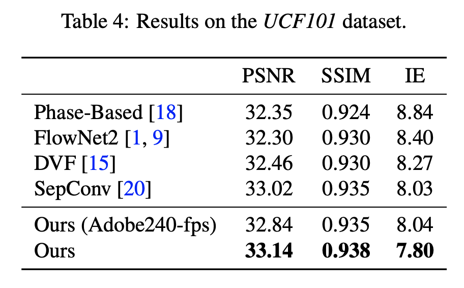
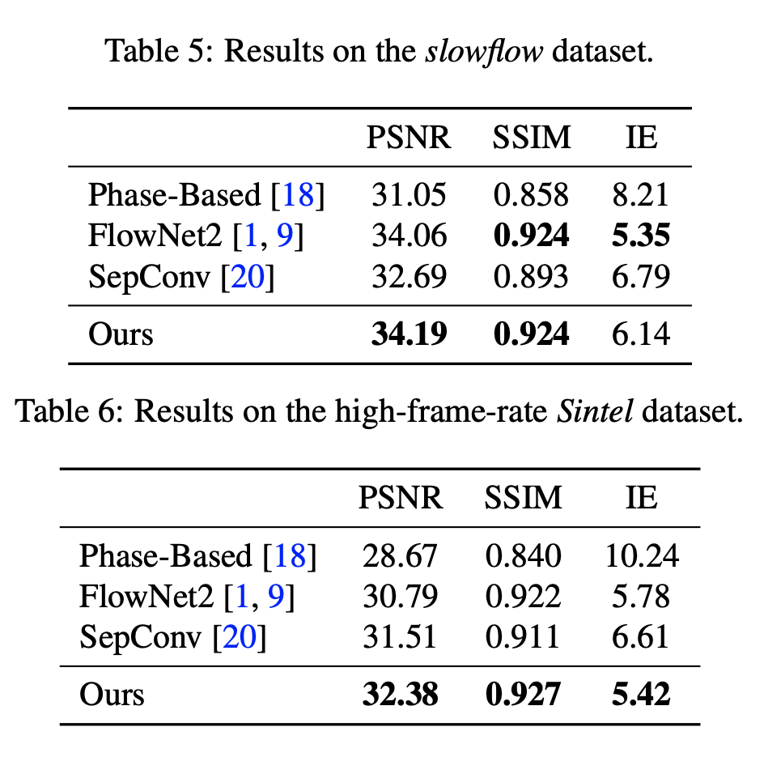
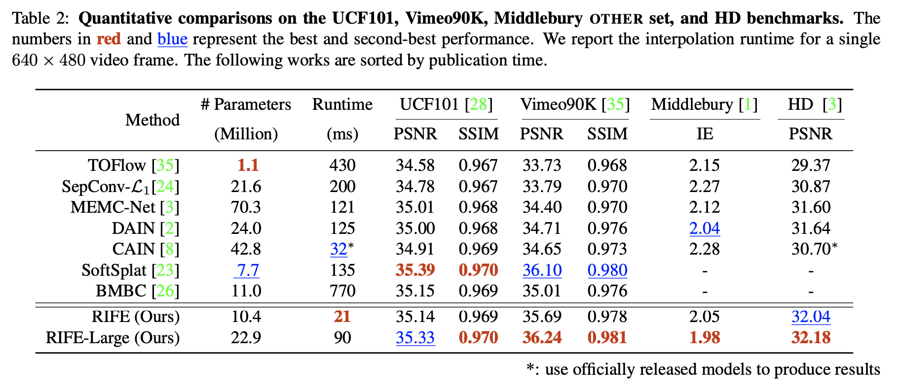

# Reproducing results of Super-SloMo  

**Super-SloMo**  
PyTorch implementation of "Super SloMo: High Quality Estimation of Multiple Intermediate Frames for Video Interpolation" by Jiang H., Sun D., Jampani V., Yang M., Learned-Miller E. and Kautz J [Github](https://github.com/avinashpaliwal/Super-SloMo)  

**RIFE**  
PyTorch implementation of "RIFE: Real-Time Intermediate Flow Estimation for Video Frame Interpolation" by Huang, Zhewei and Zhang, Tianyuan and Heng, Wen and Shi, Boxin and Zhou, Shuchang [Github](https://github.com/hzwer/arXiv2020-RIFE)  

**ViT**  
Tensorflow implementation of "Vision Transformer" by Alexey Dosovitskiy*†, Lucas Beyer*, Alexander Kolesnikov*, Dirk Weissenborn*, Xiaohua Zhai*, Thomas Unterthiner, Mostafa Dehghani, Matthias Minderer, Georg Heigold, Sylvain Gelly, Jakob Uszkoreit and Neil Houlsby*†. [Github](https://github.com/google-research/vision_transformer)  
(*) equal technical contribution, (†) equal advising.  

---
## Performance indicators
### Super-SloMo

  
  
  
  

> Evaluation metric: interpolation error (IE), which is defined as root-mean-squared (RMS) difference between the ground-truth image and the interpolated image.  

### RIFE

  

RIFE and SloMo evaluation reported Peak Signal-to-Noise Ratio (PSNR) and Structural Similarity Index (SSIM) scores.  
RIFE and RIFE-Large is shown to perform better than SloMo quantitatively on UCF101.  

---
## Links  

Inference on pretrained models.  
**Test on Video Frame Interpolation models**  
* Google Colab [Super-SloMo](https://drive.google.com/file/d/1ZLRiG26bDlaaMpCwX-esh6EkAr7L47p7/view?usp=sharing)  
  * Dataset: adobe240fps  
  * Inference output: converts video to a slomo or high fps video  
  * create_dataset.py script uses ffmpeg to extract frames from videos.  
* Google Colab [RIFE](https://drive.google.com/file/d/1VCstXdI5w3uY3WOFK6KUrEb9wvLgfLh-/view?usp=sharing)  
  * Model type: HDv2 pretrained model  
  * Dataset: HD - Bao et al, consists of a collection of 11 high-resolution videos for evaluation. The HD dataset consists of four 1080p, three 720p and four 1280 × 544 videos. The motions in this benchmark are larger than other benchmarks. 
  * inference_video.py: converts video to a high fps mp4 video
  * inference_img.py: converts images (png files) to a mp4 video or GIF

Upon testing RIFE takes significantly less time than Super-SloMo.  

RIFE paper - 
> Current flow-based models usually need to be run twice to get the bi-directional flow. Thus our intermediate flow estimation process runs around 6 − 30 times faster than previous methods. Thus IFNet provides the possibility of developing a real-time flow-based VFI algorithm. 

**Test on Vision Transformer model**  
Google Colab [ViT](https://drive.google.com/file/d/1Yqu_-YeO0ppbT0j9vlqS1RsrEW5IvTkM/view?usp=sharing)  

requirements.txt file modified.   

---
## References
Link to paper [Super-SloMo](https://arxiv.org/abs/1712.00080)   
Link to paper [RIFE](https://arxiv.org/abs/2011.06294)  
Link to paper [ViT](https://arxiv.org/abs/2010.11929)  

