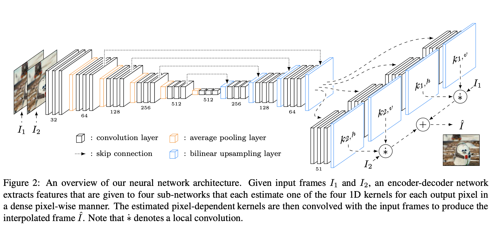
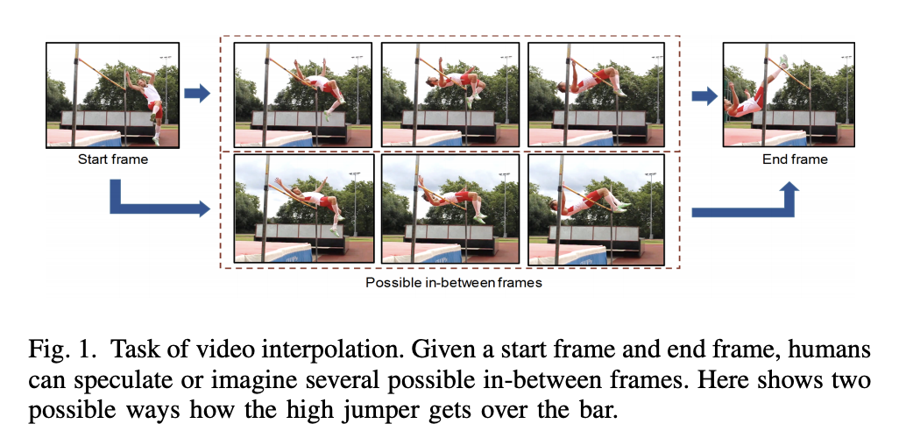
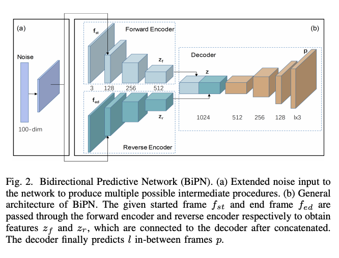
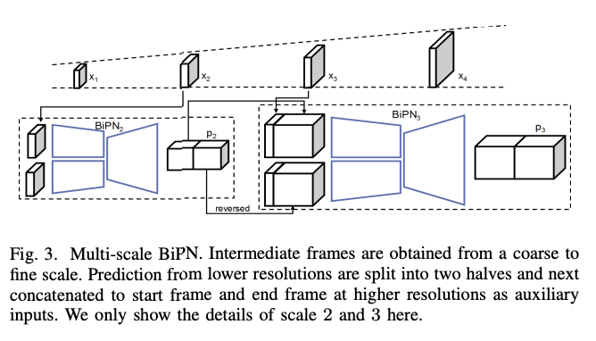

The objective of Video Frame Interpolation (VFI) is to synthesize several frames in the middle of two adjacent frames of the original video. So for example, we can upscale a 30 fps video to 60 or even 90 fps using VFI by generating ML predicted frames in between a sequence of frames.  

> Video Frame Interpolation can be applied to generate slow motion video, increase video frame rate, and frame recovery in video streaming. [reference](https://paperswithcode.com/task/video-frame-interpolation)

Video Frame Interpolation can be used in software editing tools and in generating video animations, especially in film and video production.  

---
## Standard Video Frame Interpolation methods

Standard Video Frame Interpolation methods first estimate optical flow between input frames and then synthesize an intermediate frame under the guidance of the optical flow.  

**So what is optical flow?**  
Optical flow is estimated for the task of Video Frame Interpolation. Optical Flow Estimation is the process of finding pixel-wise motions between sequence of frames or images. Motion vectors are attached to each pixel in the image to indicate where the pixel is moving to.  

The performance of standard Video Frame Interpolation methods largely depend on the quality of optical flow.  

---

## Recent Video Frame Interpolation methods  

### Video Frame Interpolation via Adaptive Separable Convolution [paper](https://arxiv.org/abs/1708.01692v1)  

The paper addresses the problem of requiring large kernels to handle large motion. Due to the large memory demand, the number of pixels whose kernels can be estimated at once is limited. By formulating frame interpolation as local separable convolution over input frames using pairs of 1D kernels.  

The authors propose a deep CNN that is fed with two input frames and estimates pairs of 1D kernels for all pixels. This method is capable of estimating kernels and synthesizes the whole video frame at once.  

  

The authors approach estimates one of the four 1D kernels for each output pixel in a dense pixel wise manner. The estimated pixel dependent kernels capture both motion and resampling information required for interpolation, they are convolved with the input frames to produce the interpolated frame.  

Estimating a pair of 1D Kernels, one horizontal and vertical, significantly reduces the large memory demand as NxN convolution kernel can be encoded using only 2N variables for each kernel. 

### Video Frame Interpolation via Adaptive Convolution [paper](https://arxiv.org/abs/1703.07514)  

Standard VFI follows a two-step approach of estimating optical flow and synthesizing pixels which depends heavily on the quality of motion estimation. For a more robust video frame interpolation the two steps are combined into a single process.  

A deep fully convolutional neural network is employed to estimate a spatially-adaptive convolution kernel for each pixel. The deep CNN can be trained directly end to end unsupervised, without hard to obtain ground truth data like optical flow.  

The method proposed in the paper estimates a convolutional kernel directly and uses that to convolve the two frames to interpolate the pixel colour. The convolution kernel captures both motion and resampling to accomplish pixel synthesis.  

### Long-Term Video Interpolation with Bidirectional Predictive Network [paper](https://arxiv.org/abs/1706.03947)  

Most existing methods only generate few intermediate frames between existing adjacent frames. The authors addresses the challenge of generating multiple frames between two non-consecutive frames in videos. A deep architecture, bidirectional predictive network (BiPN) is proposed to predict intermediate frames from two opposite directions.  

The model is evaluated on two benchmarks Moving 2D Shapes and UCF101 showing the advantages of BiPN.  
  

> The bidirectional architecture allows the model to learn scene transformation with time as well as generate longer video sequences.  

By sampling different noise vectors, the model can be extended to predict multiple possible procedures.  

---

## References

[paperswithcode on vfi](https://paperswithcode.com/task/video-frame-interpolation)  
[Research Guide for Video frame interpolation with Deep Learning](https://heartbeat.fritz.ai/research-guide-for-video-frame-interpolation-with-deep-learning-519ab2eb3dda)  

