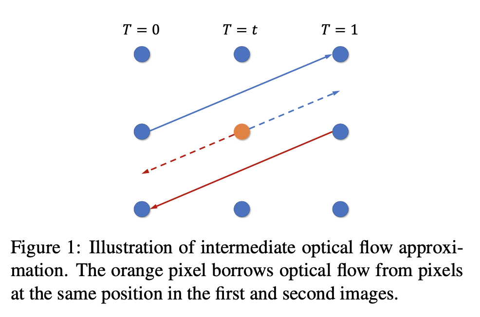
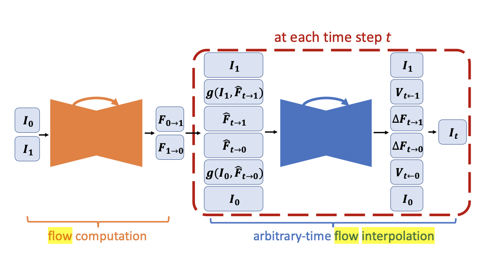
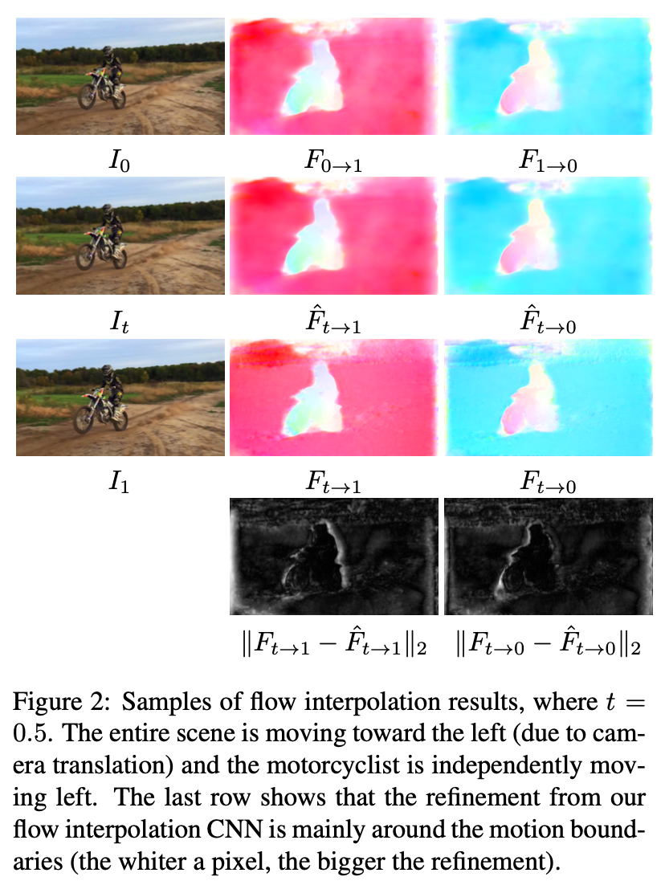
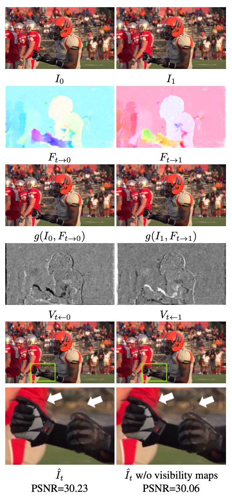
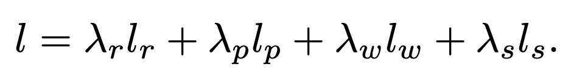
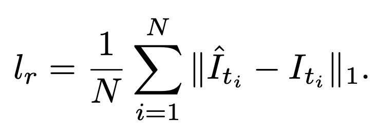
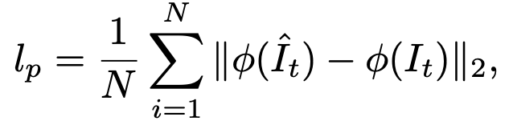
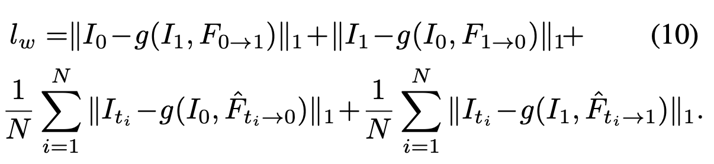
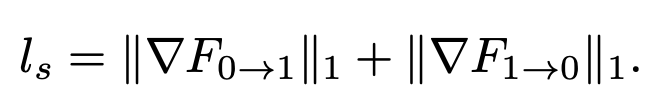

# Super SloMo [paper](https://arxiv.org/abs/1703.07514) 

The authors of SloMo proposed an end-to-end convolutional neural network for variable length multi-frame video interpolation, to generate multiple intermediate frames achieving the super slow motion effect. Existing methods mainly focused on single-frame video interpolation and have achieved impressive performance for this problem setup. The model proposed by the authors of Super-SloMo can generate an indefinite number of intermediate frames so there is no limit to how slow the videos can get.

NVIDIA demonstration video shows far superior smoothness. 

Creating a super slow motion video is very expensive as the only way to capture a slow motion is with a super high-fps camera. Recent advances of computer vision and VFI research can help address this problem.  

---
## Summary of Super SloMo

Super-Slomo is the first successful flow-based VFI algorithm.  Super-Slomo backward warps the input frames according to refined flow fields and linearly fuse them with the visibility maps to get final results. The whole system is trained with a reconstruction loss in an end to end fashion. 

**Improved:**
* incorporating the time-reversed optical flow  
* Bi-directional optical flows - forward and backward flows  

  

Fast moving objects causes blurring, some pixels occluded in one frame or the other. 
Authors compute visibility maps in order to track occlusions while simultaneously refining the initial estimation of the bi-directional flow maps in a second CNN.

### The architecture: 
* Flow computation network
* Flow interpolation network

  

Authors address the challenge of generating multiple intermediate video frames, by computing bi-directional optical flow between the two frames using a U-Net architecture, this is done by the **Flow Computation network**. The U-Net is a fully convolutional neural network consisting of an encoder and decoder with skipped connections between the encoder and decoder features at the same spatial resolution for both networks. 

The flows are linearly combined at each time step to predict the intermediate bi-directional optical flows. These prediction flows work well in locally smooth regions but can produce artifacts around motion boundaries.

**Flow Interpolation network** is added to address this problem. Flow Interpolation network is a UNet employed to refine the predicted flow and predict soft visibility maps. The two input frames are warped and linearly fused to form each intermediate frame. To avoid artifacts, the authors of SloMo applied visibility maps to the warped images before fusion to exclude the contribution of occluded pixels to the interpolated intermediate frame.  

**Backward warping function**
g( . , . ) is implemented with bilinear interpolation. Effectively reverses the effects of an optical flow of an image. 

  

 

### Structure of Network:

> We have 6 hierarchies in the encoder, consisting of two convolutional and one Leaky ReLU (α = 0.1) layers. At the end of each hierarchy except the last one, an average pooling layer with a stride of 2 is used to decrease the spatial dimension. There are 5 hierarchies in the decoder part. At the beginning of each hierarchy, a bilinear upsampling layer is used to increase the spatial dimension by a factor of 2, followed by two convolutional and Leaky ReLU layers.  

### Loss function
The loss function is a linear combination of four losses: reconstruction, perceptual, warping, and smoothness.

 

Reconstruction loss is L1 loss in RGB space against the ground truth intermediate frame. This loss models the quality of reconstructing the intermediate frame.

Perceptual loss (lp) is used to preserve details of the predictions making the frames look sharper and to minimize blurring in the predictions. The authors used L2 loss on the conv4_3 features of a VGG16 net pretrained on ImageNet. 

Warping loss (lw) used the backward warping function g to compare images to their flow-warped counterparts, for all relevant image pairs. Lw is used to model the quality of computed optical flow. 

Smoothness loss penalized the L1 norm of the gradient of the bi-directional flows to encourage neighbouring pixels to have similar flow values. 

 

---
## References

[NVIDIA “Super SloMo” Makes Video Smooth](https://medium.com/syncedreview/nvidia-super-slomo-makes-video-smooth-7bf4cffffe27)  
[Super SloMo fun. Or how you can make awesome YouTube videos with AI](https://towardsdatascience.com/super-slomo-fun-or-how-you-can-make-awesome-youtube-videos-with-ai-2d6459f6de14)  

